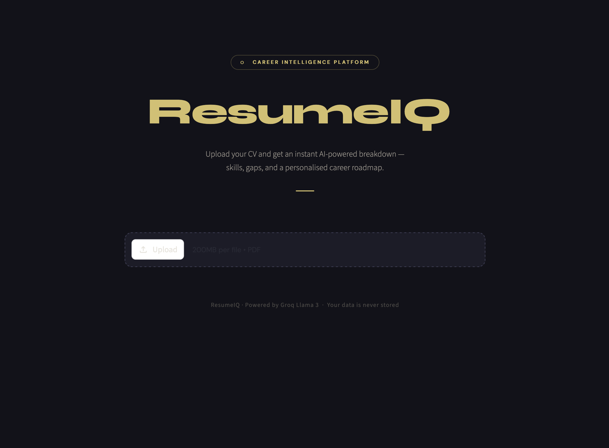

# ⬡ ResumeIQ — AI-Powered Career Intelligence Platform

> Upload your CV. Get instant AI analysis, skill gap detection, a personalised career roadmap, and live job listings from LinkedIn & Xing — all in one place.


---

## ✨ Features

| Feature | Description |
|---|---|
| 📄 **Resume Parsing** | Extracts raw text from any PDF using PyMuPDF |
| 🧠 **AI Summary** | Llama 3 (via Groq) summarises your skills, education & experience |
| 🔍 **Skill Gap Analysis** | Identifies missing certifications and experiences for better opportunities |
| 🗺️ **Career Roadmap** | Personalised action plan — what to learn, what to certify |
| 💼 **Live Job Listings** | Real-time jobs from **LinkedIn** and **Xing** via Apify |
| 🔌 **MCP Server** | Exposes job-fetching as AI-callable tools via Model Context Protocol |

---

## 🛠️ Tech Stack

- **Frontend / UI** — [Streamlit](https://streamlit.io/) with custom CSS
- **AI Engine** — [Groq](https://console.groq.com/) (Llama 3.3 70B) — free tier
- **PDF Parsing** — [PyMuPDF (fitz)](https://pymupdf.readthedocs.io/)
- **Job Scraping** — [Apify](https://apify.com/) SDK
  - LinkedIn Jobs → Actor `BHzefUZlZRKWxkTck`
  - Xing Jobs → Actor `YGO6eh6ICQXnan9L4`
- **MCP Server** — [FastMCP](https://github.com/jlowin/fastmcp) — exposes job tools to any MCP-compatible AI client
- **Config** — `python-dotenv` for secrets management

---

## 📁 Project Structure

```
resumeiq/
├── src/
│   ├── helper.py        # extract_text_from_pdf(), ask_openai() via Groq
│   └── job_api.py       # fetch_linkedin_jobs(), fetch_xing_jobs() via Apify
├── mcp_server.py        # FastMCP server — exposes job tools over stdio
├── app.py               # Main Streamlit UI
├── .env                 # API keys (never commit this)
├── .env.example         # Template for contributors
├── requirements.txt
└── README.md
```

---

## ⚙️ Setup & Installation

### 1. Clone the repo
```bash
git clone https://github.com/yourusername/resumeiq.git
cd resumeiq
```

### 2. Create and activate a virtual environment
```bash
python3 -m venv .venv
source .venv/bin/activate       # Mac/Linux
.venv\Scripts\activate          # Windows
```

### 3. Install dependencies
```bash
python -m pip install streamlit groq pymupdf apify-client python-dotenv mcp fastmcp
```

### 4. Configure environment variables

Create a `.env` file in the root:
```env
GROQ_API_KEY=gsk_...
APIFY_TOKEN_KEY=apify_api_...
```

> **Get your keys:**
> - Groq (free) → [console.groq.com](https://console.groq.com)
> - Apify → [console.apify.com/account/integrations](https://console.apify.com/account/integrations)

### 5. Run the Streamlit app
```bash
streamlit run app.py
```

### 6. Run the MCP server (optional)
```bash
python mcp_server.py
```

---

## 🔌 MCP Server

ResumeIQ includes an MCP (Model Context Protocol) server that exposes the job-fetching functions as AI-callable tools. This means any MCP-compatible AI client — such as Claude Desktop — can call these tools directly during a conversation, without any manual code.

### Available MCP Tools

| Tool | Description | Input |
|---|---|---|
| `fetchlinkedin` | Fetches live LinkedIn jobs via Apify | `listofkey` — job title keyword |
| `fetchxing` | Fetches live Xing Technology jobs in Germany | `listofkey` — location keyword |

### How it works

```
AI Client (e.g. Claude Desktop)
        ↓  calls tool: fetchlinkedin("Data Analyst")
MCP Server (mcp_server.py)
        ↓  calls fetch_linkedin_jobs("Data Analyst")
Apify Actor (LinkedIn scraper)
        ↓  returns live job listings
AI Client receives structured job data
```

### Connect to Claude Desktop

Add this to your `claude_desktop_config.json`:
```json
{
  "mcpServers": {
    "resumeiq": {
      "command": "python",
      "args": ["/absolute/path/to/mcp_server.py"],
      "env": {
        "APIFY_TOKEN_KEY": "your_apify_token"
      }
    }
  }
}
```

Then ask Claude: *"Find me Data Analyst jobs in Germany"* — it will call your tool automatically.

---

## 🚀 How the Full App Works

```
User uploads PDF
      ↓
PyMuPDF extracts raw text
      ↓
Groq Llama 3 runs three prompts
  ├── Resume Summary
  ├── Skill Gap Analysis
  └── Career Roadmap
      ↓
User clicks "Get Job Recommendations"
      ↓
Groq extracts best-fit job title keyword from resume
      ↓
Apify fetches live jobs in parallel
  ├── LinkedIn (keyword + Germany, 60 results)
  └── Xing (Technology discipline, Germany, 60 results)
      ↓
Live job cards rendered with direct apply links
```

---

## 📦 requirements.txt

```
streamlit
groq
pymupdf
apify-client
python-dotenv
mcp
fastmcp
```

---

## ⚠️ Common Errors

| Error | Fix |
|---|---|
| `No module named 'anthropic'` | Run `python -m pip install` not just `pip install` |
| `ModuleNotFoundError: pymupdf` | Try `import fitz` instead of `import pymupdf` in helper.py |
| `Groq 429` | You hit the free rate limit — wait a minute and retry |
| `ApifyApiError: Input not valid` | Check `startUrl` is `""` not `None` in fetch_xing_jobs |
| `KeyError: DefaultDatasetId` | Use lowercase `defaultDatasetId` when reading Apify run results |
| `'OpenAI' object has no attribute 'actor'` | You have a `client` naming conflict — rename Apify client to `apify_client` |

---

## 📄 License

MIT License — free to use, modify and distribute.

---

<p align="center">Built with ❤️ using Streamlit · Groq · Apify · FastMCP</p>
